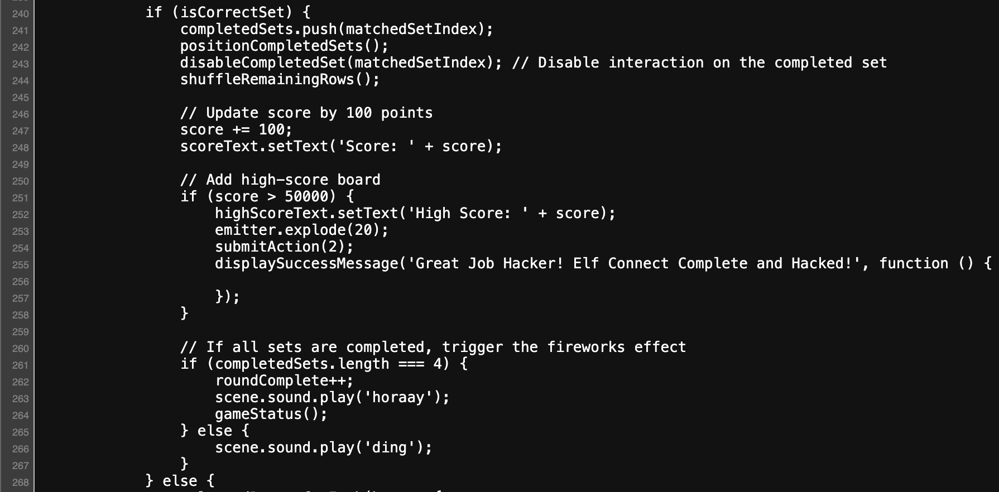

# Prologue

[Holiday Hack Orientation](#holiday-hack-orientation)
[[#Holiday Hack Orientation]]
[[#Elf Connect]]
[[#Elf Minder 9000]]

## Holiday Hack Orientation

Go talk with Jingle Ringford. Through chatting with him, he gives us our snowball badge (magic never melting snow from Christmas island) which we can use to check our progress, challenges, hints, etc.


### First Terminal
**Location:** Frosty's Beach (Jingle Ringford)

Click on the cranberry pi terminal (labeled "First Terminal"). This will run a quick test to make sure the cranberry pi terminal style questions are working for you. All you have to do is follow the onscreen instructions:


`Click on upper part of terminal, type "answer" and press enter.`

Once we do that, the orientation will be complete! If we talk to Jingle Ringford again, he let's us know that all the challenges have an easy (Silver) and hard (Gold) mode this year (except Frostbit Decrypt and Frostbit Deactivate).
## Elf Connect
**Location:** Frosty's Beach (Angel Candysalt)


If we talk to Angel Candysalt, he asks us to play the game "Connections" where you have to find 4 related words and match them all together. You keep doing this until all the words on the board have been matched to a group. He also mentions that a user (randomElf) has a suspiciously high score (he hints that he might have tampered with the game).
### Silver
To get the Silver achievement for this challenge, we need to complete the game by correctly matching all the words together for all 4 rounds. It would not be a bad idea to go and research all of these items and logically figure it out, but this is Holiday Hack! So I looked for an easier (hackier) way to find the answers.

If we take a look at the source code (ctrl+u on firefox/chrome), you don't have to look too far until you see the following code.


As we can see, the data for all the word sets and respective answers is stored client side. We can write our own code to extract the answers from this data. The following block of javascript will do just that.

```js
const totalSets = Object.keys(wordSets).length;
for (let i = 1; i < totalSets+1; i++) {
    console.log(`Set #${i}`);
    for (let j = 0; j < totalSets; j++) {
        const cset = correctSets[j];
        const word1 = wordSets[i][cset[0]];
        const word2 = wordSets[i][cset[1]];
        const word3 = wordSets[i][cset[2]];
        const word4 = wordSets[i][cset[3]];
        console.log(`${word1} ${word2} ${word3} ${word4}`);
    }
}
```

Past this code into the console (for the elf connect iframe) and press enter.

*Note: You should normally never run untrusted code in your browser, but you can trust me :)*

This gives the following output in the console:


There's all the answers for us to use!

**Answers:**

	Set  1
	Tinsel Garland Star Lights
	Sleigh Bag Mittens Gifts
	Belafonte Jingle Bells Crosby White Christmas
	Comet Vixen Prancer Blitzen
	
	Set  2
	Nmap netcat Wireshark Nessus
	burp OWASP Zap Nikto wfuzz
	Frida Cycript AppMon apktool 
	Metasploit Cobalt Strike HAVOC Empire 
	
	Set  3 
	AES RSA Blowfish 3DES 
	WEP WPA2 TKIP LEAP 
	Symmetric Asymmetric hash hybrid 
	Caesar One-time Pad Ottendorf Scytale 
	
	Set  4 
	IGMP IPX IP ICMP 
	TLS SSL IPSec SSH
	Ethernet PPP IEEE 802.11 ARP
	HTTP FTP SMTP DNS

Now simply go through the game and match all the sets correctly until you get to the end. That will give you the Silver achievement.
### Gold
To get the gold achievement, we need to beat the high score of 50,000. The hint we were given by Angel Candysalt was that they think that score was achieved through tampering with the game. Maybe we can take advantage of something similar to secure the high score for ourselves.

A good first step in this would be to take a look at the code for the game. We can do that by using ctrl+u on firefox/chrome. Looking at the source code we can see that the score is updated every time you correctly select a group of 4 words (a set). That is shown in the code block below.



Looking at this code, we can see that when a correct set is made, the `score` variable is incremented by 100. If we use the dev tools console in our browser to add extra points to the score variable, our score should be correctly updated after we make a correct set. Lets try.

In the browser's dev tools console, with the Elf Connect game open (make sure you select the iframe as the target for the console) write `score = 999999` and press enter.


Now if we select a correct set, the code that is shown above should run and we should see our score update accordingly.


Awesome! That should trigger the achievement for Gold!
## Elf Minder 9000
**Location:** Frosty's Beach (Poinsettia McMittens)


#### Silver
In talking with Poinsettia McMittens, he tells us that we should try playing the Elf Minder game. The goal of the game is to create a path for the elf to move around and collect all the crates before going to the finish flag. To complete the Silver achievement for Elf Minder, you need to complete all of the levels excluding "A Real Pickle".

Here is an example route for the "Sandy Start" level using only path segments.


This will get the job done, but is rather slow. You can use tunnels to teleport the elf from one spot to another (only one tunnel per level) as well as use springs to speed up your elf and jump over obstacles like rocks. Here is an example of a route that uses tunnels and springs to go a bit faster.


Using those principles, you can complete the first 12 levels up to "Driftwood Dunes" and get the Silver achievement.
#### Gold (A Real Pickle)
After solving the first 12 levels, the last level "A Real Pickle" is unlocked.


Up until now, all the levels have been solvable without any hacking. As you can see with "A Real Pickle" the finish line is not accessible at all. We will have to find a way around this to beat it.

In his last couple lines of dialogue,  Pointsettia mentions that he has found some weirdness with the springs, but he doesn't want to "comment" on that any further. After hearing this, I immediately assumed that the springs are going to be a key to solving this challenge, and that we will probably find a "comment" in the source code that will help us with this.

Looking at the source code, we find this snippet in the `guide.js` file.


We see the comment "fix this" in a function called (getSpringTarget). This function is called to get the location (target) where the player should land after hitting a spring. Let's break down what is going on in this function.

At the start, we set up some local variables (journey, dx, dy) to get the direction the player is moving at the moment. Then we find the next point the player will be at and initialize a couple more variables (searchLimit to limit how many squares we check for a suitable landing, searchIndex to count how many squares we have checked, and validTarget). Next we do a while loop while validTarget is falsy. For each loop, we increment the searchIndex to keep track of whether we're past the searchLimit, then we get the next point our player will be at using our known direction of travel. 

Now we instantiate "entityHere" to the result of a `find` function where we look for any entities in the game that satisfy the following conditions:
- The entity is either a Portal or a Spring.
- searchIndex isn't 0.
- The entity is at the location of the next point for the player.

If the `find` function finds a suitable entity, "entityHere" will be set to that entity and no longer be undefined. At that point, `validTarget` will get set to `entityHere` and the loop will finish. Once the if statement with the "fix this" comment is run, it will see that `entityHere` is truthy so it will return `this.segments[0][0]`. What this represents is the first point in the first segment that was placed by the user. The `segments` variable is an array of segments where a segment is represented by an array containing two length 2 arrays which are the start and end x/y positions for that segment.

`Segment: [[start_x, start_y],[end_x, end_y]]`

Basically what all this means, is that if your character encounters a spring and in the games path search to find where the character should land, it finds another spring or a portal, it will instead jump your character to the first point of the first segment that was placed. Knowing this, we can place the first segment on the finish line, and purposely put a spring/portal in our spring's launch path allowing us to jump over the rocks and end the level.

If you find yourself running out of springs, you can add more using the console:

```
game.entities.push([position_x, position_y, 7])
```

This adds a new entity with the given x and y position with the entity type of 7 (spring).

Using all of this knowledge, lets build a route that will beat this level.

*NOTE: You must place the first segment on the finish line for this to work!*


Press start and you should see your elf collect all the boxes and finally jump to the finish line.


As you can see we finished the level! I also got the high score (not very long lived). You should now have the Gold achievement.

See next: [Act 1](../act1/act1.md)
